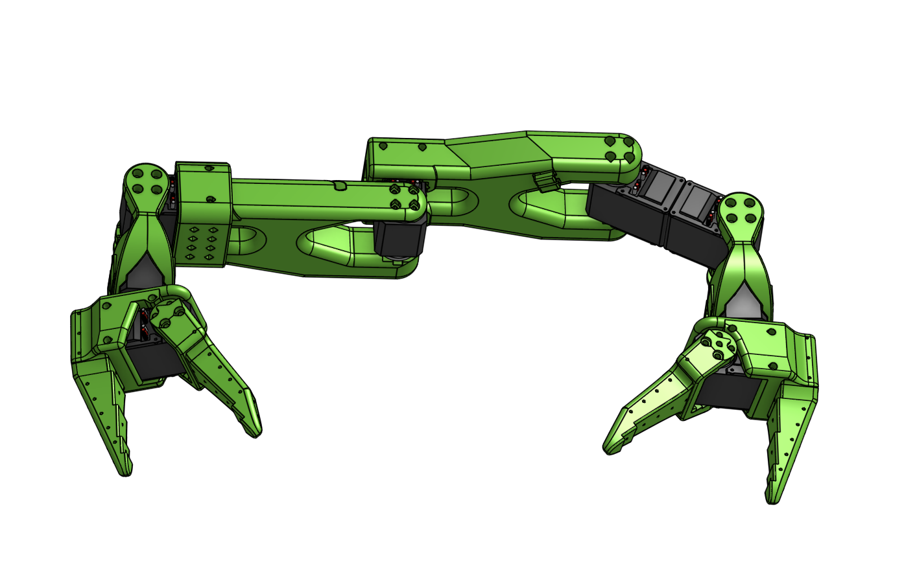

# Dual-Arm Brachiation Robot

A reinforcement learning project for training a dual-arm robot to move by grasping and swinging (brachiation locomotion) using MuJoCo physics simulation.



## Features

- **MuJoCo Physics Simulation**: Fast and accurate physics simulation
- **Gymnasium Environment**: Standard RL interface compatible with popular libraries
- **Stable-Baselines3 Integration**: Ready-to-use PPO training
- **Interactive Visualization**: Real-time 3D viewer with camera controls
- **Minimal Setup**: Just install dependencies and run!

## Quick Start

### 1. Install Dependencies

```bash
# Create virtual environment (recommended)
python -m venv venv
source venv/bin/activate  # On Windows: venv\Scripts\activate

# Install requirements
pip install -r requirements.txt
```

### 2. Visualize the Robot

```bash
# Interactive viewer
python src/main.py

# Or use the visualization script
python scripts/visualize.py --mode viewer
```

### 3. Run a Demo

```bash
# Demo with sinusoidal movements
python src/main.py --mode demo

# Or with custom duration
python src/main.py --mode demo --duration 20.0
```

### 4. Train with Reinforcement Learning

```bash
# Start training (with visualization)
python src/main.py --mode train

# Train headless (faster, for servers)
python src/main.py --mode train --headless --num-envs 8

# Train with custom settings
python src/main.py --mode train --total-timesteps 2000000 --num-envs 16
```

### 5. Evaluate a Trained Model

```bash
python src/main.py --mode eval --model-path ./checkpoints/brachiation_final
```

## Project Structure

```
dual2/
├── mujoco/
│   └── robot.xml           # MuJoCo model file
├── src/
│   ├── main.py             # Main entry point
│   └── envs/
│       └── brachiation_env.py  # Gymnasium environment
├── scripts/
│   └── visualize.py        # Visualization utilities
├── assets/
│   ├── parts/              # STL mesh files
│   └── urdf/               # Original URDF (reference)
├── checkpoints/            # Saved models (created during training)
├── logs/                   # Training logs (created during training)
└── requirements.txt
```

## Command Reference

### Main Script (`src/main.py`)

| Command | Description |
|---------|-------------|
| `python src/main.py` | Interactive viewer |
| `python src/main.py --mode demo` | Run demo simulation |
| `python src/main.py --mode train` | Train with PPO |
| `python src/main.py --mode eval` | Evaluate trained model |
| `--headless` | Run without visualization |
| `--num-envs N` | Number of parallel environments |
| `--total-timesteps N` | Total training timesteps |
| `--seed N` | Random seed for reproducibility |

### Visualization Script (`scripts/visualize.py`)

| Command | Description |
|---------|-------------|
| `--mode viewer` | Interactive MuJoCo viewer |
| `--mode demo` | Sinusoidal joint demo |
| `--mode test` | Test joint limits |
| `--mode record` | Record video |
| `--mode info` | Print model information |

## Viewer Controls

When using the interactive viewer:

| Control | Action |
|---------|--------|
| Mouse drag | Rotate camera |
| Right-click drag | Pan camera |
| Scroll | Zoom in/out |
| Double-click | Track body |
| Space | Pause/Resume |
| Backspace | Reset simulation |
| Tab | Toggle visualizations |
| ESC | Exit |

## Environment Details

### Observation Space (38D)
- Base position (3D) and orientation (4D quaternion)
- Base linear (3D) and angular (3D) velocity
- Joint positions (8D)
- Joint velocities (8D)
- Fingertip positions (6D)
- Target bar position (3D)

### Action Space (8D)
- Continuous joint position targets, normalized to [-1, 1]

### Reward Function
- Forward progress reward
- Height maintenance penalty
- Energy efficiency (action cost)
- Velocity bonus
- Proximity to target bar reward
- Bar reaching bonus

## Training Tips

1. **Start with fewer environments** for debugging:
   ```bash
   python src/main.py --mode train --num-envs 1
   ```

2. **Use TensorBoard** to monitor training:
   ```bash
   tensorboard --logdir ./logs/tensorboard
   ```

3. **Adjust hyperparameters** by editing the PPO config in `src/main.py`

4. **Checkpoints** are saved every 10,000 steps in `./checkpoints/`

## Troubleshooting

### "MuJoCo model not found"
Make sure you're running from the project root directory:
```bash
cd /path/to/dual2
python src/main.py
```

### "No module named 'mujoco'"
Install MuJoCo:
```bash
pip install mujoco
```

### Viewer not opening
Ensure you have a display available. For headless servers:
```bash
python src/main.py --mode train --headless
```

## License

See LICENSE file for details.

## Acknowledgments

- Robot model created using Onshape and converted with `onshape-to-robot`
- Powered by [MuJoCo](https://mujoco.org/) physics engine
- RL training with [Stable-Baselines3](https://stable-baselines3.readthedocs.io/)

### Prerequisites

- Isaac Lab (latest version): https://github.com/NVIDIA-Omniverse/IsaacLab
- Clone this repository

### How to Run

1. **Open Isaac Lab Terminal**
    - Launch the Isaac Lab terminal (see Isaac Lab docs for your OS).

2. **Navigate to Project Directory**
    ```bash
    # Windows
    cd C:\path\to\dual2
    # Linux/Mac
    cd /path/to/dual2
    ```

3. **Run Training Script**
    ```bash
    # Windows (PowerShell)
    ..\IsaacLab\isaaclab.bat -p src/main.py --task DualArmBrachiation

    # Linux/Mac
    ../IsaacLab/isaaclab.sh -p src/main.py --task DualArmBrachiation
    ```
    This launches Isaac Sim with GUI and starts RL training.

#### Options

- Change number of environments:
  ```bash
  # Windows
  ..\IsaacLab\isaaclab.bat -p src/main.py --task DualArmBrachiation --num_envs 1024
  # Linux/Mac
  ../IsaacLab/isaaclab.sh -p src/main.py --task DualArmBrachiation --num_envs 1024
  ```
- Run headless (no GUI):
  ```bash
  # Windows
  ..\IsaacLab\isaaclab.bat -p src/main.py --task DualArmBrachiation --headless
  # Linux/Mac
  ../IsaacLab/isaaclab.sh -p src/main.py --task DualArmBrachiation --headless
  ```

### Key Files

- Robot URDF: `assets/urdf/robot.urdf`
- Main script: `src/main.py`
- Environment config: `src/brachiation_env_cfg.py`
- RL config: `src/workflows/ppo_runner_cfg.py`
